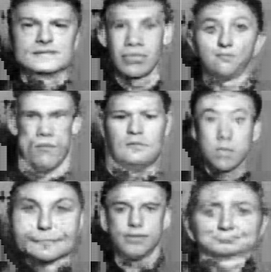
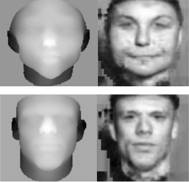
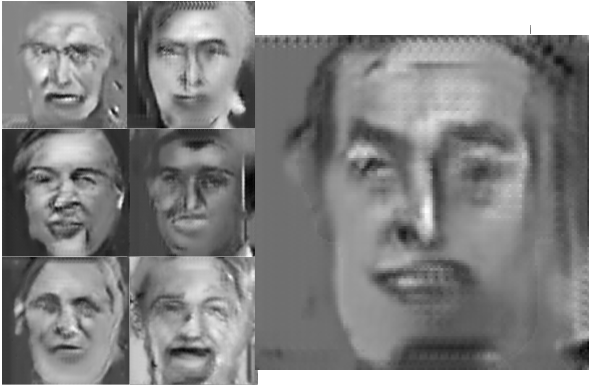
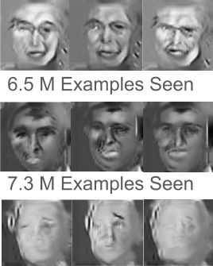
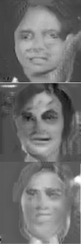
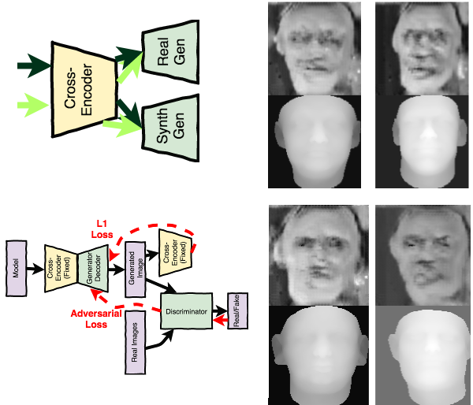
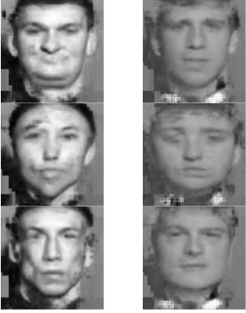

# Deep Frankenstein: Bringing synthetic faces to life

This post describes the project that I undertook as part of the Insight AI Fellowship.  I spent around three weeks on it, which was enough time to explore a number of approaches, but not much time to refine any of these.  The code to run the experiments is in this repository.  

  ...hopefully converted to...  

### Motivations
The task that I worked on was converting depth maps of faces into realistic images.  This lends itself nicely to the catchy and/or spooky title.  It can also be seen as an image-to-image translation problem in which the images can be aligned.  To me though, this is an example of taking a model of something and creating a realistic output from that model. 

With this kind of a problem, there are two basic goals:
1) Create something realistc
2) Create something that corresponds to the model

I tried to use these two questions as a guide to addressing the task of generating faces.  I also tried to avoid approaches that would work for this task, but wouldn't generalize if the model weren't a picture, or if the model weren't aligned with the target.  

I was hoping to spend more time on the second question, but found it more difficult than expected to create a realistic output.  

As an aside, my original goal was to take a robotic sounding speech synthesizer and try to convert that to realistic sounding speech, and I hope to look into that over the next couple of weeks.  

### Data

To generate the depth maps I generated models with the Basel Face Model.  The model itself was created by averaging 100 faces.  To sample a model from it, one specifies a vector of 15 principal components.  The model has both shape and texture, but I only used the shape component.  This is represented by a .ply file, which is basically just a list of polygons.  To convert this into a depth map I sampled points from the polygons and then resized to my desired image size (128 X 128).  

### Supervised Approach

My first approach to tackling the problem was to use supervised learning.  There are a number of datasets that have depth maps and face images - these seem to have been used for face recognition in the early 2000's.  The only one that I was able to obtain is the Notre Dame Collection D dataset, which is pretty small, having images of 377 people.  

I used the pictured generator/refiner architecture.  Unless otherwise noted, I used this generator for all of the experiments.  Looking back, it may have worthwhile to experiment with a larger network.  A couple of other people in the insight group also used sub-pixel convolutions for the upsampling as opposed to deconvolutions/fractionally strided convolutions, and seemed to get good results.  

With that out of the way, even with the small training sample, this worked really well.  It created realistic faces, the faces match the depth maps, and the faces are of different people.  I think this last point is important.  While it's a matter of how you define the task, I think a successful model should find face "types" that correlate to the depth maps, as opposed to taking a particular face type and stretching it into every possible shape.  I'll show some of the results here.  These were randomly selected from a "test" set of images that I generated (as opposed to the ND depth maps that it was trained on).  

 

This, I think, is a real testament to how nice it is to have supervised data.  The approaches with no superversion or weaker supervision are undoubtedly cooler, but this just kinda works.  An interesting point to think about as well, is that where it's possible to generate the model from the images - then you can use supervised learning without a dataset.  This would be the case if, for example, your model was an edge image.  It may be possible for this particular task as well, as there are some papers where they were able to [generate basel face models](https://arxiv.org/pdf/1701.05360.pdf) from images.

### Unsupervised

I'll open up the discussion of doing this in an unsupervised manner by showing some results:

These images are from the first run where I got reasonable results.  I think it's cool that the model created pictures with different facial expressions.  Especially looking at the mouth - some faces have open mouths, and the larger images appears to be smiling.  One could argue that this isn't particularly faithful to the depth maps (which have closed mouths to the extent they mouths at all), but I think being able to add these features is a lot of the appeal of the process of upgrading a model. 

Getting to this point was more challenging than anticipated.  I thought that because it's pretty easy to learn the mapping from supervised data, that even given GAN's (Generative Adversarial Networks) reputation for being hard to train, that it wouldn't be that bad in this case.  This didn't really end up being true.  Firstly though, here's a brief description of how a GAN or adversarial loss works, as illustrated here:

Basically you train a second function called a disciminator.  The input to the discriminator is real images from the data set as well as generated images.  This loss for this function is how well it can determine which set each image came from, and this loss gets backpropogated to the generator/refiner.  This loss allows for the generator to learn how to create images that are hard to distinguish from those in the real dataset at a given point in time.  The time part is where it get's tricky, because the discirminator is not an oracle function, but something that itself is being trained.  Sometimes it may pick irrelevant features to distinguish the two classes, and only towards of the end of training will it be faced with distinguishing between reasonably good generations and real images.  Most of the time the difference is really obvious and the discriminator doesn't have to pick useful features.

The problem that I was having is what in GAN literature is refered to as "mode collapse."  Ideally you want to map your noise, or in my case, my depth map, to a range of possible outputs.  What often happens though, is that the network instead, maps all inputs to the same image - in this case the same face.  In addition, I found that the model was cycling through these faces as it ran.  Here is an example of this.  

I tried to deal with this in a couple of ways.  Firstly, I experimented with L2 loss as outlined in [this paper](https://arxiv.org/pdf/1611.04076.pdf) and Wasserstein distance loss as outlined [here](https://arxiv.org/pdf/1701.07875.pdf), but neither improved the images.  I also tried a technique called experience replay.  Here, instead of feeding the discriminator only the images that have just been generated, you feed it a combination of those images and images that were generated in past steps.  This doesn't stop the mode collapse, but I think that it helps lessen the extent of the cycling.  Using this, I got somewhat better images. 

 

The GAN component definitely needs more tweeking.  There are techniques like feature matching ([see here](https://arxiv.org/pdf/1606.03498.pdf)) that try to explicitly enforce beter hetergeneity in the generated images.  It might also be useful to use something like a variational auto-encoder where you force the maps to represent a normally distributed latent space.  One difference with refining an image as opposed to using noise, is that in the case of noise the generator is fed points resaonably sampled from a distribution.  Forcing the models to do the same could certainly be useful.  

Another way to go with this would be to add conditions (hair color, glasses, beards, skin tone, etc).  While it seems to me that it's intuitively harder to generate an image with an added condition, the opposite seems to be true with GAN's.  This actually makes a lot of sense.  In a conditional GAN, the discriminator is trained on not only whether the images are real, but also whether the real images have certain attributes.  This is a lot of additinal information.  With this approach, you have a model that's trained to look for relavent features, and then uses these same filters to discriminate between the image classes.  This should force it to do this on the basis of patterns like those found in the relevant features, which should lead to better generations.  

### Semi-Supervised

Unfortunately the GAN didn't lead to faces that really met either goal #1 or goal #2.  They weren't that realistic and they weren't particularly bound to the model.  Assuming that we could get the GAN to be more realistic, there would still be the second issue.

One way to try to enforce cohesion with the model in a completely unsupervised fashion is to add reconstruction loss.  We can add another function that maps the generated image back to the model.  While this isn't an explicit constraint in the mathematical sense, this should discourage the generator from mapping the model into something "difficult" to reconstruct.  Adding weight regularization to this second network may further encourage this.  

Unfortunately, I never got reasonable results with this.  I think getting the reconstruction loss right is tricky.  Towards the end of the project period, [this paper](https://arxiv.org/pdf/1703.10593.pdf) came out that uses reconstruction loss in this way, so it must be doable.  

I got a little better results with a semi-supervervised version of this.  This is roughly inspired by [this paper](https://arxiv.org/pdf/1611.02200.pdf) that maps faces to emojis.  Here, I am taking the arhitecture above, but replacing the generator with a combination of a fixed encoder and trainable decoder, and replacing the reconstructor with only the fixed encoder.  The encoder is trained as a cross-encoder.  The image quality didn't quite break through, and there were still issues with mode collapse, but I think this would be worth tuning in the future.  

Lastly, a really simple way to do this in a semi-supervised fashion is to combine the L1 loss from the paired images with the adversarial loss from the inpaired images.  This is similar to the [Pix-2-Pix](https://phillipi.github.io/pix2pix/) approach, only using a separate set of images to add the adversarial loss, as opposed to the same set as in the paired images.  These images are more similar to the supervised data set than I would like, given that it's a pretty limited dataset, but the pictures are also more natural.  Here are some results:

