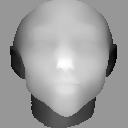
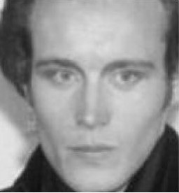
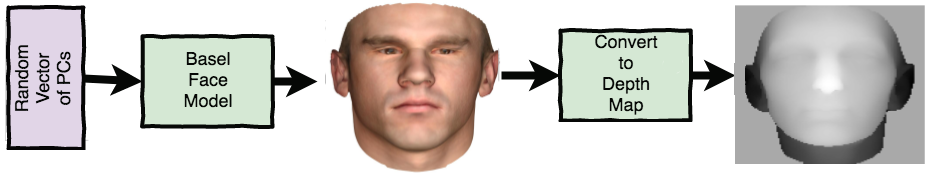

# Deep Frankenstein: Bringing synthetic faces to life

This post describes the project that I undertook as part of the Insight AI Fellowship.  I spent around three weeks on it, which was enough time to explore a number of approaches, but not much time to refine any of these.  The code to run the experiments is in this repository.  

  ...hopefully converted to...  

### Motivations
The task that I worked on was converting depth maps of faces into realistic images.  This lends itself nicely to the catchy and/or spooky title.  It can also be seen as an image-to-image translation problem in which the images can be aligned.  To me though, this is an example of taking a model of something and creating a realistic output from that model. 

With this kind of a problem, there are two basic goals:
1) Create something realistc
2) Create something that corresponds to the model

I tried to use these two questions as a guide to addressing the task of generating faces.  I also tried to avoid approaches that would work for this task, but wouldn't generalize if the model weren't a picture, or if the model weren't aligned with the target.  

I was hoping to spend more time on the second question, but found it more difficult than expected to create a realistic output.  

As an aside, my original goal was to take a robotic sounding speech synthesizer and try to convert that to realistic sounding speech, and I hope to look into that over the next couple of weeks.  

### Data and such

To generate the depth maps I generated models with the Basel Face Model.  The model itself was created by averaging 100 faces.  To sample a model from it, one specifies a vector of 15 principal components.  The model has both shape and texture, but I only used the shape component.  This is represented by a .ply file, which is basically just a list of polygons.  To convert this into a depth map I sampled points from the polygons and then resized to my desired image size.  The level of detail the depth map is to an extent determined by the number of points sampled.  

